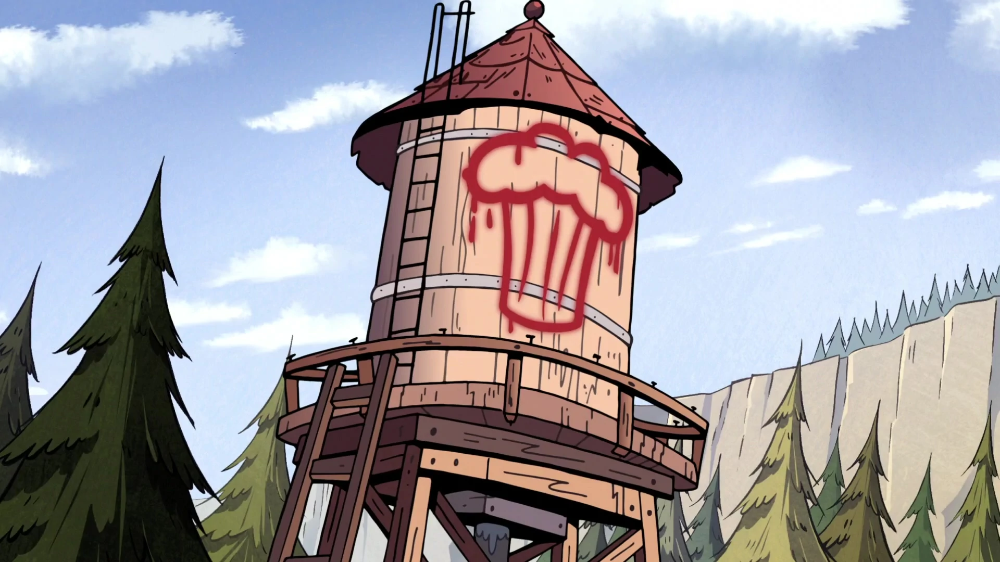
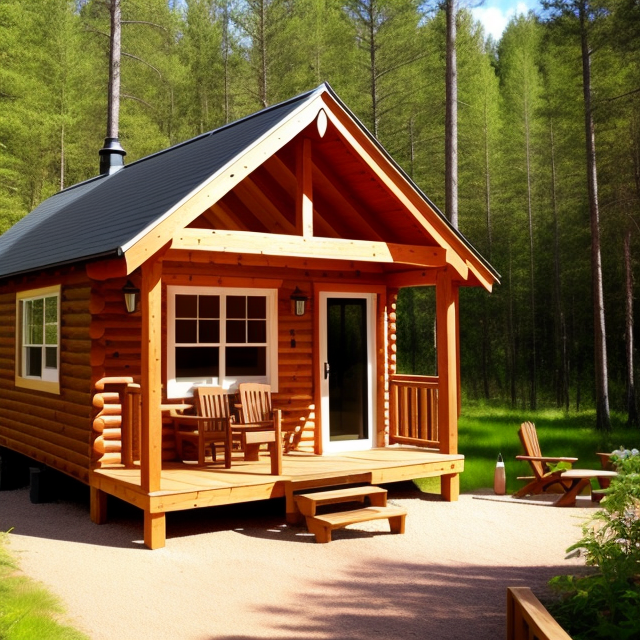
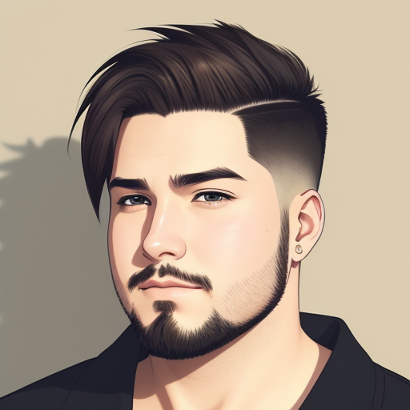
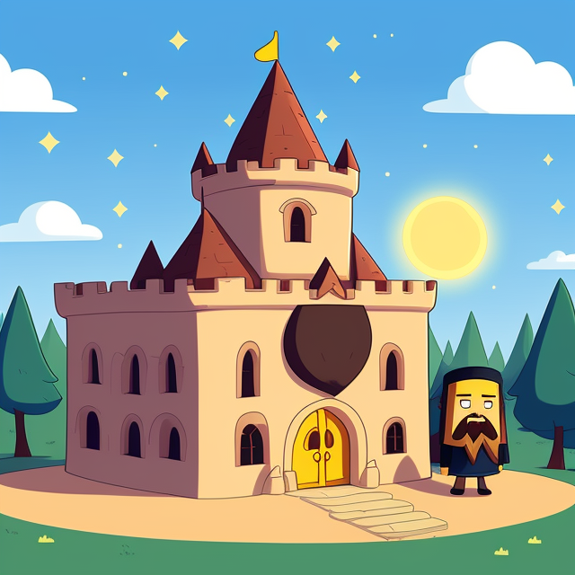

# Алексей


--------------------------------


## Увлекаюсь генерацией картинок в Stable-Diffusion
__________________________________________
**Вот пара примеров моих картинок**
<details>
  <summary>Промт и негатив</summary>

  ```
small cosy cabin from outside
Negative prompt: (deformed, distorted, disfigured:1.3), poorly drawn, bad anatomy, wrong anatomy, extra limb, missing limb, floating limbs, (mutated hands and fingers:1.4), disconnected limbs, mutation, mutated, ugly, disgusting, blurry, amputation
Steps: 22, Sampler: Euler a, CFG scale: 7, Seed: 636127269, Size: 640x640, Model hash: 9aba26abdf, Model: deliberate_v2, ENSD: 31337
  ```
</details>


<details>
  <summary>Промт и негатив</summary>

  ```
male, undercut hair, chubby, (anime), (illustration), cartoon, detailed
Negative prompt: (deformed, distorted, disfigured:1.3), poorly drawn, bad anatomy, wrong anatomy, extra limb, missing limb, floating limbs, (mutated hands and fingers:1.4), disconnected limbs, mutation, mutated, ugly, disgusting, blurry, amputation
Steps: 25, Sampler: Euler a, CFG scale: 4.5, Seed: 1530280319, Size: 512x512, Model hash: 9aba26abdf, Model: deliberate_v2, ENSD: 31337
  ```
</details>


<details>
  <summary>Промт и негатив</summary>

  ```
cute mage, beard, [small cosy cabin from outside : castle : 0.16], adventure time style, cartoon
Negative prompt: (distorted, disfigured:1.3), extra limb, missing limb, floating limbs, (mutated hands and fingers:1.4), disconnected limbs, mutation, mutated, ugly, disgusting, blurry, amputation
Steps: 24, Sampler: Euler a, CFG scale: 4, Seed: 1875912188, Size: 640x640, Model hash: 9aba26abdf, Model: deliberate_v2, ENSD: 31337
  ```
</details>


### Контактная информация

- Email: example@mail.com
- Телефон: 8-800-555-35-35
